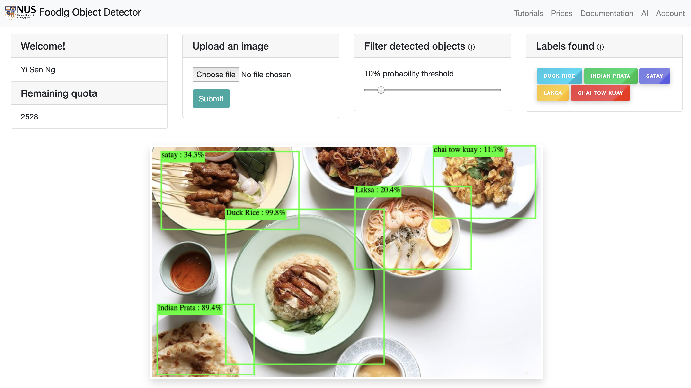

# Foodlg Object Detector Web App



1. User uses Web UI to authenticate with external Okta server 
2. Once authenticated, users can send an image to Model API
3. Model API returns object data and Web UI displays detected objects
4. User interacts with Web UI to view and filter detected objects

## Access the Live Demo

http://ec2-3-93-15-96.compute-1.amazonaws.com:8090/

## Featured Technologies

* [Node.js](https://nodejs.org/): An open-source JavaScript run-time environment for executing server-side JavaScript code.
* [JQuery](https://jquery.com): jQuery is a cross-platform JavaScript library designed to simplify the client-side scripting of HTML.
* [Express](https://expressjs.com): A popular and minimalistic web framework for creating APIs and Web servers.

## Steps (run locally)

#### Start the Web App

1. [Get a local copy of the repository](#1-get-a-local-copy-of-the-repository)
2. [Install dependencies](#2-install-dependencies)
3. [Start the web app server](#3-start-the-web-app-server)

#### 1. Get a local copy of the repository

Clone the web app repository locally. In a terminal, run the following command:

```
$ git clone https://github.com/vaanforz/Foodlg-Object-Detector-Web-App.git
```

Change directory into the repository base folder:

```
$ cd Foodlg-Object-Detector-Web-App
```

#### 2. Install dependencies

Make sure Node.js and npm are installed then, in a terminal, run the following command:

```
$ npm install
```

#### 3. Start the web app server

You then start the web app by running:

```
$ nodejs app
```

You can then access the web app at: [`http://localhost:8090`](http://localhost:8090)

## Experiment with the API (Optional)

Use the `model/predict` endpoint to load a test image and get predicted labels for the image from the API.
The coordinates of the bounding box are returned in the `detection_box` field, and contain the array of normalized
coordinates (ranging from 0 to 1) in the form `[ymin, xmin, ymax, xmax]`.

You can also test it on the command line, for example:

```
$ curl -F "image=@assets/dog-human.jpg" -XPOST http://localhost:5000/model/predict
```

You should see a JSON response like that below:

```json
{
  "status": "ok",
  "predictions": [
      {
          "label_id": "1",
          "label": "person",
          "probability": 0.944034993648529,
          "detection_box": [
              0.1242099404335022,
              0.12507188320159912,
              0.8423267006874084,
              0.5974075794219971
          ]
      },
      {
          "label_id": "18",
          "label": "dog",
          "probability": 0.8645511865615845,
          "detection_box": [
              0.10447660088539124,
              0.17799153923988342,
              0.8422801494598389,
              0.732001781463623
          ]
      }
  ]
}
```

You can also control the probability threshold for what objects are returned using the `threshold` argument like below:

```
$ curl -F "image=@assets/dog-human.jpg" -XPOST http://localhost:5000/model/predict?threshold=0.5
```

The optional `threshold` parameter is the minimum `probability` value for predicted labels returned by the model.
The default value for `threshold` is `0.7`.
